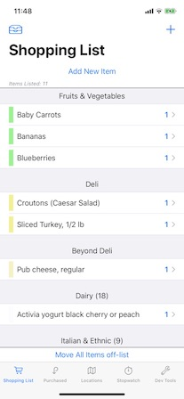
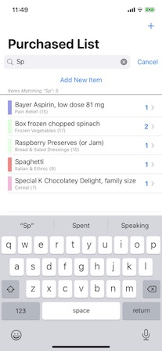

#  About "ShoppingList14"

This is a simple, iOS app to process a shopping list that you can take to the grocery store with you, and move items off the list as you pick them up.  It persists data in CoreData.  The project should be compiled with XCode 12.2 or later and run on iOS14.2 or later.

* An [earlier version of this project](https://github.com/delawaremathguy/ShoppingList) is available that works with XCode 11.7/iOS 13.7.  If you have not yet made the move to XCode 12.2 and iOS 14.2, you should use this earlier project instead.

Feel free to use this as is, to develop further,  to completely ignore, or even just to inspect and then send me a note or post an Issue to tell me I am doing this all wrong.  

## First Public Update for iOS 14: December 4, 2020

XCode 12 has finally stabilized ?), and I have finally upgraded my iPhone to a more stable iOS14.2.  So I felt it safe to make some refinements and possibly use features of iOS 14 in updating this project.  I also just got a new iPad Air 4, so the time has come to work on iPad implementation.  This repository has been built using XCode 12.2 and will run under iOS 14.2, and I am now regularly using this updated app on my iPhone.

Please be sure to read the What's New in ShoppingList14 section below, primarily for implementation and code-level changes.

## General App Structure

    

    

The main screen is a TabView, to show 

* a current shopping list (which can appear as a single section, or in multiple sections by Location) 

* a (searchable) list of previously purchased items, with one section showing items "purchased today" and a second section showing all other items (not shown in the photos above)

* a list of "locations" in a store, such as "Dairy," "Fruits & Vegetables," "Deli," and so forth

* an in-store timer, to track how long it takes you to complete shopping, and

* optionally, for purposes of demonstration, a "Dev Tools" tab to make wholesale adjustments to the data

For the first two tabs, tapping on the circular button on the leading edge of an item's display moves a shopping item from one list to the other list (from "on the list" to "purchased" and vice-versa).  

Tapping on any item (*not the leading circular button*) in either list lets you edit it for name, quantity, assign/edit the store location in which it is found, or even delete the item.  Long pressing on an item gives you a contextMenu to let you move items between lists, toggle between the item being available and not available, or directly delete the item.  (*Items not available will have a strike-thorugh, italic presentation on screen*.)

The shopping list is sorted by the visitation order of the locations, and then alphabetically within each location.  Items in the shopping list cannot be otherwise re-ordered, although all items in the same Location have the same color as a form of grouping.  Tapping on the leading icon in the navigation bar will toggle the display from a simple, one-section list, to a multi-section list.

The third tab shows a list of all locations, each having by a visitation order (an integer from 1...100, as in, go to the dairy first, then the deli, then the canned vegetables, etc).  One special Location is the "Unknown Location," which serves as the default location for all new items.  I use this special location to mean that "I don't really know where this item is yet, but I'll figure it out at the store." The unknown llocation has the highest of all visitation order values, so that it comes last in the list of Locations, and shopping items with this unassigned/unknown location will come at the bottom of the shopping list. 

Tapping on a Location in the list lets you edit location information, including reassigning the visitation order, change its color, or delete it.  In this updated version, the color is settable using the ColorPicker available in iOS 14.  You will also see a list of the Items that are associated with this Location. A long press on a location (other than the "unknown location") will allow you to delete the location directly.

* What happens to Items in a Location when the Location is deleted?  The Items are not deleted, but are moved to the Unknown Location.

The fourth tab is an in-store timer, with three simple button controls: "Start," "Stop," and "Reset."  This timer does *not* pause when the app goes into the background -- e.g., if you pull up a calculator or take a phone call while shopping. (*See Development.swift if you wish to change this behaviour*.)

Finally, there is a  tab for "development-only" purposes, that allows wholesale loading of sample data, removal of all data, and offloading data for later use. This tab is not one intended to appear in a production version of the app (*see Development.swift to hide this*).

So, 

* **If you would like to test out this app and decide if it might be of interest to you**, run it on the simulator, go straight to the Dev Tools tab on startup and tap the "Load Sample Data" button.  Now you can play with the app.

* **If you plan to install and use this app on your own device**, the app will start with an empty shopping list and an location list having only the special "Unknown Location"; from there you can create your own shopping items and locations associated with those items.  (*Hint: add locations first!*)

## What's New in ShoppingList14

Things have changed [since the previous release of this project](https://github.com/delawaremathguy/ShoppingList) for XCode 11 that was titled, simply, **ShoppingList**.  Although this project is called "ShoppingList14," it carries the same name and signature as the previous project, but is now officially "version 2.0". 

Here are some (and possibly all) of the user-facing changes to the app:

* The three primary tabs (Shopping List, Purchased, and Locations) now use a `Form` presentation, rather than a `List` presentation.

* The Purchased items tab now presents shopping items that were "purchased today" in its first section (which may be empty) and everything else in a second section.  This makes it easy to review the list of today's purchases, possibly to quickly locate any item that you may have accidentally tapped off the Shopping List so you can put it back on the list.

* A ColorPicker has be added to make it easier to adjust the color of a Location.

Here are some of the major, code-level changes:

* The AppDelegate-SceneDelegate application structure has been replaced by the simplified App-Scene-WindowGroup structure introduced for XCode 12/iOS 14.

* The `ShoppingItem` entity in Core Data from Version 1.0 has been renamed, simply, as `Item`.  

* Each `Item` now has a `dateLastPurchased` property that is reset to "today" whenever you move an item off the shopping list.

* There have been other name changes to the Core Data model (you will read about these and why they were made in the code) and I have versioned the model. Although I *hope* previous CD models will migrate data from earlier models, I *cannot guarantee this, based on my own experience*.  Unfortunately, I lost data during migration on my own device (from V1 to V2) due to some combination of using the new App structure, or issues in XCode.

* Many code changes have been made or simplified and comments throughout the code have been updated. 

* The basic architecture of the app has been simplified.  What started out initially as a few views with simple @FetchRequests then morphed into more of a strict MVVM-style architecture using view models and Notficiations that completely avoided using @FetchRequest (*simple Core Data deletions and @FetchRequest don't play nicely together*).  Version 2.0 of the app has now morphed into ... *wait for it* ... an app having a few views with simple @FetchRequests (*because I have now discovered one special aspect of Core Data that makes @FetchRequest work with Core Data deletions, and I have finally come to understand more about SwiftUI view creation and deletion*).  This is shocking!

* Views can effect changes to Items and Locations by calling class functions defined on `Item` and `Location` directly, which then are handled appropriately by the Core Data classes as if they were acting as view models.

* There are no "view models," as such, in this code.  

* There is no use of the NotificationCenter.

### Core Data Notes

The CoreData model has only two entities named `Item` and `Location`, with every `Item` having a to-one relationship to a `Location` (the inverse is to-many).

* `Item`s have an id (UUID), a name, a quantity, a boolean that indicates whether the item is on the list for today's shopping exercise, or not on the list (and so available in the purchased list for future promotion to the shopping list), and also a boolean that provides an italic, strike-through appearance for the item when false (sometimes an item is on the list, but not available today, and I want to remember that when planning the future shopping list).  New to this project is the addition of a Date for an Item to keep track of when the Item was last purchsed.

* `Location`s have an id (UUID), a name, a visitationOrder (an integer, as in, go to the dairy first, then the deli, then the canned vegetables, etc), and then values red, green, blue, opacity to define a color that is used to color every item listed in the shopping list. 

* Almost all of the attribute names for the `Item` and `Location` enities are different from before, and are "fronted" using (computed) variables in the Item and Location classes.  Example: the Item entity has a `name_` attribute (a String) in the Core Data model, but we define a set/get variable `name` in Item+Extensions.swift of type `String` to make it available to all code outside of the Core Data bubble, as it were, to read and write the name.  (Reading `name` does a nil-coalesce on the optional `name_` property of the Item class in Swift.)  You will read about this strategy of fronting Core Data atrributes in code comments.

* This version of the app has added versions 2 and then also 3 of the Core Data datamodel, to handle these renaming issues and to add a dateLastPurchased attribute to every Item.

### App Architecture Comment

As I said above, this app started out as a few SwiftUI views driven by @FetchRequests, but that eventually ran into trouble when deleting Core Data objects.  Next, I tried to insert a little Combine into the app (e.g., a view driven by a list of Locations would turn the list into a subscriber to each of the Locations in the list), but there were problems with that as well.  

I finally settled on more of an MVVM-style architecture, posting internal notifications through the NotificationCenter that an `Item` or a `Location` has either been created, or edited, or is about to be deleted.  View models would react appropriately.

That design worked in  version 1.0 of ShoppingList, but I decided that I should go back and revisit the design again.  What always bothered me about the current state of SwiftUI views using @FetchRequest was that they need to know or understand that the data they process comes from Core Data, as well as expose some of the gritty details of Core Data (e.g. @FetchRequests needed to know about SortDescriptors and keyPaths) and possibly know when to unwrap or test for nil on values.

The design here lives somewhere between MVVM and basic, @FetchRequest-driven SwiftUI views.  My stated goal of the redesigned code is that 

* no SwiftUI view should ever know that its data comes from Core Data and should never access raw attributes of a CD object directly

* no SwiftUI view should ever need to `import CoreData`.  

I have found a way to make this happen in the redesign, and I think the result works quite well.

Please be sure to read about some subtleties of this rewrite in the code.

###  View Updating Issues

I built this project in public initially as an experiment, to simply get a lot of practice with SwiftUI, and to look more deeply and perhaps offer some suggested code to the folks who keep running into what I call SwiftUI's **generic problem**:

> An item appears in View A; it is edited in View B (perhaps appearing as a subview of Vew A, or as a detail view via a NavigationLink or a .sheet presentation); but its appearance in View A does not get updated properly in response to an edit.  

SwiftUI does a lot of the updating for you automatically, but the situation is more tricky when using Core Data because the model data consists of objects (classes), not structs.  

SwiftUI does provide `@FetchRequest` and `@ObservedObject` and `@EnvironmentObject` and `@StateObject` (and the Combine framework if you go deeper), but the updating problem is not completely solved just by sprinkling @ObservedObject property wrappers around in your code.  It matters in SwiftUI whether you pass around structs or classes among SwiftUI Views, and exactly how you pass them.  What I have learned is that *SwiftUI really wants you to use structs, but Core Data is all about objects*.  

Indeed, the biggest issue that I found in the early days of this app involved handling updates following a **deletion** of a Core Data object.  My conclusion was (and remains) that @FetchRequest and SwiftUI don't always interact that well with respect to Core Data deletions.  That is exactly what drove me to the architecture you will find looking back at the original ShoppingList project. 

However, the architecture of ShoppingList14 is now, at the main level, more the expected architecture of a @FetchRequest-driven SiftUI interface.  But it's cleaner!  It accommodates the issues associated with joining these two technologies, insulating Views both from deletions (*I belive*) and reliance of something like @ObservedObject to insure proper updating (*I believe*).  Please be sure to work your way through the code, where you will find several comments that discuss these accommodations.

## Future Work

Some things I may continue to work on in the future include adding CloudKit, real support for iPad, and data export (e.g., to email or print a copy of a shopping list).  However, perhaps these are best left to the energetic reader.

* Hint: It is easy to handle the email piece, since there are several "mail views for SwiftUI" already on Github. [This is one from Mohammad Rahchamani](https://github.com/mohammad-rahchamani/MailView) that I have used in another project and it works quite easily for any SwiftUI app.)

A more energetic improvement would be to expand the database and the app's UI to support multiple "Stores," each of which has many "Locations," and "Items" would have a many-to-many relationship with "Locations" so one item can be available in many Stores. I do now shop at several different stores, so as a user, the idea is of some interest ...

However, no matter what I produce from this point onward, I am certainly not at all interested in creating the next, killer shopping list app or moving any of this to the App Store.  *The world really does not need a new list-making app*.  But, if you want to take this code and run with it ... go right ahead.

## Closing

The project is what it is -- a project that began trying to learn how to best use SwiftUI with a Core Data store. On a basic level, understanding the SwiftUI lifecycle of how Views come and go turned out to be a major undertaking.  On the Core Data side, using @FetchRequest was the obvious, right thing -- until it wasn't.  Then adding a few sprinkles of Combine looked like the right thing -- until it wasn't.  I learned a lot ... and that was the point of this project.

Nevertheless, this upgrade to the original ShoppingList has returned to where it started: using SwiftUI views driven by a @FetchRequest.  The code may be easier to follow for beginning developers (there are no sophisitcated "view models"), while at the same time I have tried to point out important points about how SwiftUI and @FetchRequest really do interact (*at least I think I have*).

Feel free to contact me about questions and comments, or post an Issue here on GitHub.

## License

* The SearchBarView in the Purchased items view was created by Simon Ng.  It appeared in [an article in AppCoda](https://www.appcoda.com/swiftui-search-bar/) and is copyright ©2020 by AppCoda. You can find it on GitHub as [AppCoda/SwiftUISearchBar](https://github.com/AppCoda/SwiftUISearchBar). 
* The app icon was created by Wes Breazell from [the Noun Project](https://thenounproject.com). 
* The extension I use on Bundle to load JSON files is due to Paul Hudson (@twostraws, [hackingwithswift.com](https://hackingwithswift.com)) 

Otherwise, almost all of the code is original, and it's yours if you want it -- please see LICENSE for the usual details and disclaimers.

