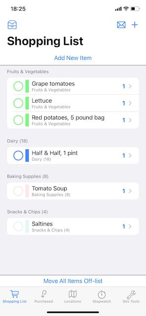
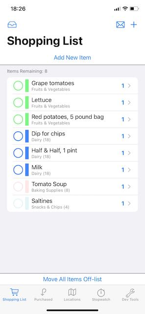
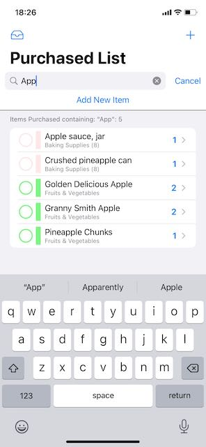
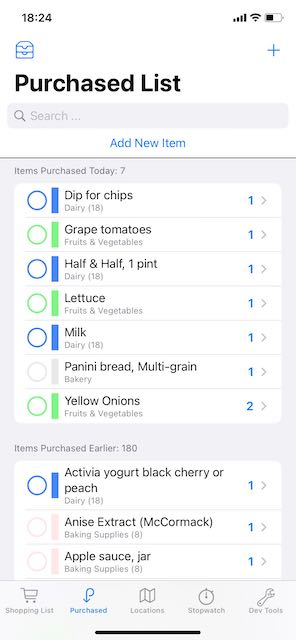
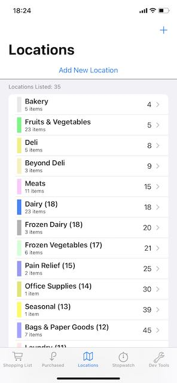

#  About "ShoppingList14"

This is a simple iOS app to process a shopping list that you can take to the grocery store with you, and move items off the list as you pick them up.  It persists data in CoreData and uses SwiftUI.  The project should be compiled with XCode 12.2 or later and run on iOS 14.2 or later.

* An [earlier version of this project](https://github.com/delawaremathguy/ShoppingList) is available that works with XCode 11.7/iOS 13.7.  If you have not yet made the move to XCode 12.2 and iOS 14.2, you should use this earlier project instead.

Feel free to use this as is, to develop further,  to completely ignore, or even just to inspect and then send me a note or Post an Issue to tell me I am doing this all wrong.  

## First Public Update for iOS 14: 4 December, 2020

XCode 12 has finally stabilized (?), and I have also upgraded my iPhone to a more stable iOS 14.2.  So I felt it safe to make some refinements and possibly use features of iOS 14 in updating this project.  

This repository has been built using XCode 12.2 and will run under iOS 14.2. Please be sure to read the *What's New in ShoppingList14* section below, primarily for implementation and code-level changes that were made in producing the initial iOS 14 release.  

Here are recent updates either of importance (e.g., *bug fixes* or *UI changes*) or of possible coding interest (e.g., *code consolidation or reorganization*) since the first public release of December 4:

### Update of 20 January, 2021.

* Updated screenshots and README.

### Previous Updates since the iOS 14 Release

* (5 Jan) Fixed an issue where a shopping Item might be deleted in one AddOrModifyItemView in the app, while a second AddOrModifyItemView was still open on the Item in a different tab.  (*See comments in AddOrModifyItemView.swift*.) 
* (5 Jan) Fixed an issue where a new Location was added, but it would not be immediately available to the Picker that allows you to associate an Item with it.
* (30 Dec) Added the ability to send the current shopping list by email (which could then be printed, if you wish), using [MailView by Mohammad Rahchamani](https://github.com/mohammad-rahchamani/MailView), albeit with apology to the author, since I have made a slight adjustment to the original parameter passing protocol used in MailView.  Touch the *envelope* icon in the navigation bar in ShoppingListTabView to bring up the mailer (*active only if you have the capability to send mail, which will not be the case when running in the simulator*).
* (30 Dec) The PurchasedItemsTabView now has a button, top-leading in the navigation bar, to switch between a flat list and a list of two sections (items purchased today, and items purchased before then).
* (30 Dec) Fixed a minor updating issue for the PurchasedItemsTabView for the case where the app was suspended while this view was on-screen, but the app became active at a later time (*the concept of "today" might have changed while the app was inactive*).
* (30 Dec) Removed the "Delete All Data" button in the Dev Tools tab (*it seemed to want to crash every now and then!*).  There's no reason why you need this: in the simulator, just delete the app and start over; on a device, you probably don't want to add sample data to get started anyway.
* (26 Dec) Changed `ShoppingListDisplay` to rely on a @FetchRequest of Locations that have Items on the shopping list.  This seems more natural, and the multi-section display code is easier to understand. It also fixes an updating problem created by having switched out `SelectableItemRowView` to rely on @ObservedObject.  (*Please Open an Issue if you find that this or the use of @ObservedObject has broken the code*.)
* (25 Dec) Rewrote much of the Discussion in `Item+Extensions.swift` to be, shall we say, *more accurate*.
* (25 Dec) Perhaps it is due to iOS 14.2, but Core Data deletions no longer seem overly harmful to SwiftUI and @ObservedObject references.  So `SelectableItemRowView` is now simplified, accepting an @ObservedObject reference to an `Item` (rather than a copy of its data).  Together with nil-coalesced properties on `Item`, this view appears to no longer require special care and feeding for item deletions.  Appropriate changes have been made to comments throughout the code and in the README.  
* (16 Dec) Consolidated the code in ShoppingListTabView, PurchasedItemsTabView, LocationsTabView, AddOrModifyItemView, and AddOrModifyLocationView to centralize a common rubric for opening an Alert that confirms a destructive action.  The logic and code for implementing this is very simple. *See ConfirmationAlert.swift*.
* ~~(7 Dec) Fixed an updating issue for `Item` when displayed in the shopping list or the purchased item list.  In some cases, edits to its associated Location were not being properly reflected for the Item's `locationName`, `visitationOrder`, and `uiColor`.  See comments in `Location.updateValues`~~ *This issue was addressed in changes made on 26 Dec*.

## General App Structure

The main screen is a TabView, to show 

* a current shopping list (which can appear as a single section, or in multiple sections by Location) 

   

* a (searchable) list of previously purchased items, with one section showing items "purchased today" and a second section showing all other items (not shown in the photo above)

   

* a list of "locations" in a store, such as "Dairy," "Fruits & Vegetables," "Deli," and so forth

 

* an in-store timer, to track how long it takes you to complete shopping, and

* optionally, for purposes of demonstration only, a "Dev Tools" tab to make wholesale adjustments to the data

For the first two tabs, tapping on the circular button on the leading edge of an item's display moves a shopping item from one list to the other list (from "on the shopping list" to "purchased" and vice-versa).  

Tapping on any item (*not the leading circular button*) in either list lets you edit it for name, quantity, assign/edit the store location in which it is found, or even delete the item.  Long pressing on an item gives you a contextMenu to let you move items between lists, toggle between the item being available and not available, or directly delete the item.  (*Items not available will have a strike-through, italic presentation on screen*.)

The shopping list is sorted by the visitation order of the locations, and then alphabetically within each location.  Items in the shopping list cannot be otherwise re-ordered, although all items in the same Location have the same user-assignable color as a form of grouping.  

Tapping on the leading icon in the navigation bar of the Shopping List will toggle the display from a simple, one-section list, to a multi-section list. Tapping on the "envelope" trailing icon allows you to send an email with the shopping list to whomever would prefer a printed copy.

Tapping on the leading icon in the navigation bar of the Puchased Item List will toggle the display from a simple, one-section list, to a two-section list that breaks out items as those purchased "today" and those purchased earlier.

The third tab shows a list of all locations, each having a visitation order (an integer from 1...100, as in, go to the dairy first, then the deli, then the canned vegetables, etc).  One special Location is the "Unknown Location," which serves as the default location for all new items.  I use this special location to mean that "I don't really know where this item is yet, but I'll figure it out at the store." The unknown location has the highest of all visitation order values, so that it comes last in the list of Locations, and shopping items with this unknown location will come at the bottom of the shopping list. 

Tapping on a Location in the list lets you edit location information, including reassigning the visitation order, changing its color, or deleting it.  In this updated version, the color is settable using the ColorPicker available in iOS 14.  You will also see a list of the Items that are associated with this Location. A long press on a location (other than the "unknown location") will allow you to delete the location directly.

* What happens to Items in a Location when the Location is deleted?  The Items are not deleted, but are moved to the Unknown Location.

The fourth tab is an in-store timer, with three simple button controls: "Start," "Stop," and "Reset."  This timer does *not* pause when the app goes into the background -- e.g., if you pull up a calculator or take a phone call while shopping. (*See Development.swift if you wish to change this behaviour*.)

Finally, there is a tab for "development-only" purposes, that allows wholesale loading of sample data and offloading data for later use. This tab is not one intended to appear in a production version of the app (*see Development.swift to hide this*).

Here's what you do next:

* **If you would like to test out this app and decide if it might be of interest to you**, run it on the simulator, go straight to the Dev Tools tab on startup and tap the "Load Sample Data" button.  Now you can play with the app.

* **If you plan to install and use this app on your own device**, the app will start with an empty shopping list and a location list having only the special "Unknown Location"; from there you can create your own shopping items and locations associated with those items.  (*Hint: add Locations before adding Items!*)  I would suggest that you remove the Dev Tools tab before installing the app (see comments in Development.swift).

## What's New in ShoppingList14

Things have changed [since the previous release of this project](https://github.com/delawaremathguy/ShoppingList) for XCode 11 that was titled, simply, **ShoppingList**.  Although this project is called "ShoppingList14," it carries the same app name and signature as the previous project, but is now officially "version 2.0". 

Here are some (and possibly all) of the user-facing changes to the app:

* The three primary tabs (Shopping List, Purchased, and Locations) now use a `Form` presentation, rather than a `List` presentation.

* The Purchased items tab now presents shopping items that were "purchased today" in its first section (which may be empty) and everything else in a second section.  This makes it easy to review the list of today's purchases, possibly to quickly locate any item that you may have accidentally tapped off the Shopping List so you can put it back on the list.

* A ColorPicker has been added to make it easier to adjust the color of a Location.

* You can now email your shopping list to yourself or a friend.

Here are some of the major, code-level changes:

* The AppDelegate-SceneDelegate application structure has been replaced by the simplified App-Scene-WindowGroup structure introduced for XCode 12/iOS 14.

* The `ShoppingItem` entity in Core Data from Version 1.0 has been renamed, simply, as `Item`.  

* Each `Item` now has a `dateLastPurchased` property that is reset to "today" whenever you move an item off the shopping list. *The value of its underlying Core Data attribute is optional; the value of `nil` signifies that the item was never previously purchased*. 

* There have been other name changes to the Core Data model (you will read about these and why they were made in the code) and I have versioned the model. Although I *believe* that previous CD models will migrate data from earlier models, I *cannot guarantee this, based on my own experience*.  Unfortunately, I lost data during migration on my own device (from V1 to V2) due to some combination of using the new App structure, or mixing versions of XCode with the version of iOS on my phone.

* Many code changes have been made and much has been simplified.

* Comments throughout the code have been updated -- some with expanded detail on why something is being done the way it is being done.

* The basic architecture of the app has been simplified.  What started out in Version 1.0 as a few views with simple @FetchRequests morphed into an MVVM-style architecture using Notifications that completely avoided using @FetchRequest.  Version 2.0 of the app has now become ... *wait for it* ... an app having a few views with simple @FetchRequests.  This is absolutely shocking!  *See the App Architecture comments below*.

* Views now effect changes to Items and Locations by calling class functions defined on `Item` and `Location` directly, which then are handled appropriately by the Core Data classes (the `Item` and `Location` classes operate, essentially, as view models for objects of their type).

* There are no "view models," as such, in this code, nor is there any use of the NotificationCenter.

### Core Data Notes

The CoreData model has only two entities named `Item` and `Location`, with every `Item` having a to-one relationship to a `Location` (the inverse is to-many).

* `Item`s have an id (UUID), a name, a quantity, a boolean that indicates whether the item is on the list for today's shopping exercise, or not on the list (and so available in the purchased list for future promotion to the shopping list), and also a boolean that provides an italic, strike-through appearance for the item when false (sometimes an item is on the list, but not available today, and I want to remember that when planning the future shopping list).  New to this project is the addition of a Date for an Item to keep track of when the Item was last purchased.

* `Location`s have an id (UUID), a name, a visitation order (an integer, as in, go to the dairy first, then the deli, then the canned vegetables, etc), and then values red, green, blue, opacity to define a color that is used to color every item listed in the shopping list. 

* Almost all of the attribute names for the `Item` and `Location` entities are different from before, and are "fronted" using (computed) variables in the Item and Location classes.  Example: the Item entity has a `name_` attribute (an *optional* String) in the Core Data model, but we define a set/get variable `name` in Item+Extensions.swift of type `String` to make it available to all code outside of the Core Data bubble, as it were, to read and write the name.  (Reading `name` does a nil-coalesce of the optional `name_` property of the Item class in Swift.)  You will read about this strategy of fronting Core Data attributes in code comments.

* This updated app has added a version 2 and then also a version 3 to the Core Data datamodel, to handle these renaming issues and to add a dateLastPurchased attribute to every Item. (It is a lightweight migration.)

### App Architecture

As I said above, this app started out as a few SwiftUI views driven by @FetchRequests, but that eventually ran into trouble when deleting Core Data objects.  For example, if a View has an @ObservedObject reference to a Core Data object and that object is deleted (while the view is still alive in SwiftUI), you could be in for some trouble.  And there are also timing issues in Core Data deletions: the in-memory object graph doesn't always get updated right away for delete operations, which means a SwiftUI view could be trying to reference something that doesn't really exist before the SwiftUI system actually learns about the deletion.

Next, I tried to insert a little Combine into the app (e.g., a view driven by a list of Locations would make the list a subscriber to each of the Locations in the list), but there were problems with that as well.  

I finally settled on more of an MVVM-style architecture, managing a list of Items or Locations myself, instead of letting @FetchRequest handle that list.  And I used internal notifications posted through the NotificationCenter that an `Item` or a `Location` had either been created, or edited, or was about to be deleted, so that view models could react appropriately.

That design worked in version 1.0 of ShoppingList ... and I liked it a lot, frankly ... but I decided that I should go back and revisit my avoidance of @FetchRequest.  

Unfortunately, what has always bothered me about the current state of SwiftUI view code that I see that uses @FetchRequest is that such a view often needs to understand that the data it processes come from Core Data.  The view must also know some of the gritty details of Core Data (e.g. @FetchRequests needed to know about sortDescriptors and keyPaths) and possibly know when to either nil-coalesce or at least test for nil values.

The design in this app now lives somewhere between MVVM and a basic, @FetchRequest-driven SwiftUI app structure.  My goal in reaching the current code structure was that all SwiftUI views should follow **these three rules**: 

* a View should never "really" know that its data comes from Core Data (*no use of Core Data keypaths or managedObjectContexts*);

* a View should never access or manipulate attributes of a CD object directly; and

* the associated "View.swift" file that defines the View should never have to  `import CoreData`.  

The code of this app **follows the three rules above**, and I think the result works quite well.

###  View Updating Issues

I built this project in public initially as an experiment, to simply get a lot of practice with SwiftUI, and to look more deeply and perhaps offer some suggested code to the folks who keep running into what I call SwiftUI's **genric view updating issue**:

> An item appears in View A; it is edited in View B (perhaps appearing as a subview of View A, or as a detail view via a NavigationLink or a .sheet presentation, or in a different tab); but its appearance in View A does not get updated properly in response to an edit.  

SwiftUI does a lot of the updating for you automatically, but the situation is more tricky when using Core Data because the model data consists of objects (classes), not structs.  

* It matters in SwiftUI whether you pass around structs or classes among SwiftUI Views, and exactly how you pass them.  This can be especially frustrating for developers who have grown up with UIKit, where almost everything is an object (class).  What I can tell you is that *SwiftUI really wants you to use structs, yet Core Data is all about objects*.  

SwiftUI does provide some help with `@FetchRequest` and `@ObservedObject` and `@EnvironmentObject` and `@StateObject` (and the Combine framework if you go deeper), but the updating problem when objects are involved is not completely solved just by sprinkling @ObservedObject property wrappers around in your code.  

Indeed, the SwiftUI view management system is designed to destroy views when no longer needed and recreate them as needed -- views are `struct`s, and view creation/deletion is very efficient.  

However, if a view maintains an object reference, say to a Core Data object ... well ... that view can't be destroyed so easily.  So, SwiftUI hangs on to such a view and *you* take on the responsibility to keep the view updated.  Often, you do that using `@ObservedObject` (although there could be implications should that object be deleted while the view is still alive).  If you don't use @ObservedObject, that view may not necessarily be updated for you by SwiftUI when its parent view gets redrawn.

Finally, the architecture of ShoppingList14 is now, at the main level, more the expected architecture of a @FetchRequest-driven SwiftUI interface, while addressing the subtleties above involving views and references that come from Core Data.  Please be sure to work your way through the code, where you will find several, extended comments that discuss these accommodations.

## Future Work

Some things I may continue to work on in the future include 

* adding CloudKit. Iit's easy to do - *I have done it in another app* - and it's just a few steps that I have outlined in PersistentStore.swift, but you will need a paid Apple Developer account to start using the cloud.

* examine support for iPad (since I now have a new iPad Air 4). I won't be taking my iPad to the store any time soon, but it would be convenient to work on the shopping list on the iPad and then, via the cloud, take my phone to the store with the updated list.

* expanding the database and the app's UI to support multiple "Stores," each of which has many "Locations," and "Items" would then have a many-to-many relationship with "Locations," since one item could be available in many Stores. I do now shop at several different stores, so as a user, the idea is of *some* interest ... but this is an ambitious project, not so much for the Core Data side, but for the UI side!

However, no matter what I might post from this point onward, please know that I am not at all interested in creating the next, killer shopping list app. It is possible at some point that I will move this to the App Store, perhaps more for the experience of going through the process.  But let's face it: *the world really does not need yet another list-making app*.  

## Closing

The project is what it is -- a project that began trying to learn how to best use SwiftUI with a Core Data store. 

* On a basic level, understanding the SwiftUI lifecycle of how Views come and go turned out to be a major undertaking.  *This may be the most difficult part for programmers coming from UIKit*.
* On the Core Data side, using @FetchRequest was the obvious, right thing -- until it wasn't.  Then adding a few sprinkles of Combine looked like the right thing -- until it wasn't.  Version 1.0 of the app settled into an MVVM type of structure.  Then, to my surprise, @FetchRequest made its way back into the app in Version 2.0.  I learned a lot ... and that was the point of this project.

The code in this project, based on using @FetchRequest, should be easier to follow for beginning developers (there are no sophisticated "view models").  Using lengthy comments in the code in various places around the app, I have also tried to make important points about how SwiftUI and @FetchRequest really do interact (*at least I think I have*).

Feel free to contact me about questions and comments, or post an Issue here on GitHub.

## License

* The SearchBarView in the Purchased items view was created by Simon Ng.  It appeared in [an article in AppCoda](https://www.appcoda.com/swiftui-search-bar/) and is copyright ©2020 by AppCoda. You can find it on GitHub as [AppCoda/SwiftUISearchBar](https://github.com/AppCoda/SwiftUISearchBar). 
* The app icon was created by Wes Breazell from [the Noun Project](https://thenounproject.com). 
* The extension I use on Bundle to load JSON files is due to Paul Hudson (@twostraws, [hackingwithswift.com](https://hackingwithswift.com)) 
* The MailView used in the ShoppingListTabView was created by [Mohammad Rahchamani](https://github.com/mohammad-rahchamani/MailView), copyright © 1399 AP BetterSleep.

Otherwise, just about all of the code is original, and it's yours if you want it -- please see LICENSE for the usual details and disclaimers.

